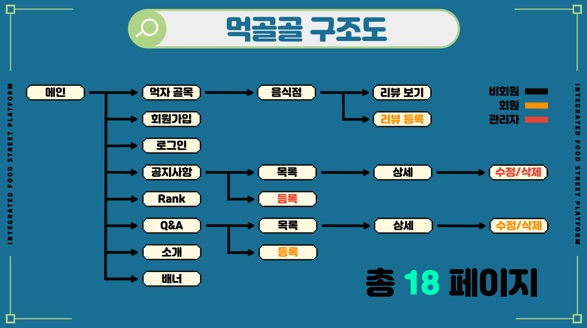
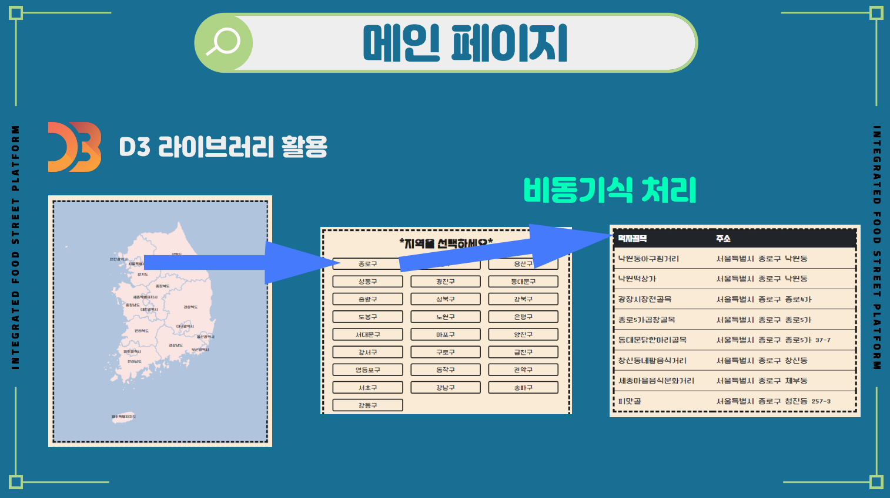
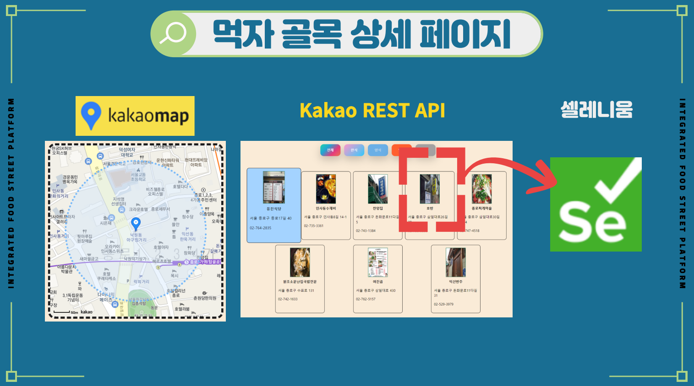

# 먹골골 프로젝트
## 전국 먹자골목 통합 정보 웹 
> 기획 동기

레트로 열풍으로 인한 전통 시장 방문 증가  
하지만 전통시장이나 먹자골목을 대상으로한 서비스 없음 
힘들게 주변 먹자골목을 찾아보지 않아도 
일일히 음시점들의 리뷰를 검색하지 않아도  
간단하게 정보를 찾아 볼 수 있는데 웹 사이트 제작

> 사용 기술
* Spring Boot
* Mysql
* Thymeleaf
* Selenium
* AWS RDS
* HTML, CSS, jQuery
> 외부 서비스 API
* 카카오 map
> 나의 작업
* DB 설계 구축 및 연동
* 메인 페이지
* 회원가입
* 먹자 골목 상세 페이지
>먹골골 구조도

 

>메인 페이지

 

>먹자골목 상세페이지

 

> 개발 중 고민 사항

전국 먹자골목의 식당을 조사하기에는 프로젝트 시간이 별로 없었고  시간이 지나면 변하는 식당정보를 고려하여 kakao map의 위치정보를 기반으로  
주변의 식당을 가져와 이미지와 상세정보를 크롤링하는 선택을 하였다. 

셀레니움은 

